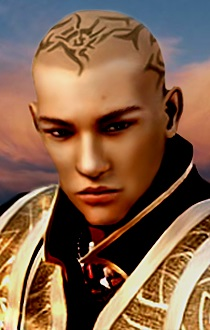

<html>

<b>Iylos NPC</b>

<b>NPC mod for ToB and EET</b>

A mod originally written by K'aeloree. 
Iylos can join your party during your visit to Saradush only.  

Iylos Mirdan is from Amkethran, a Desert City near the border of Tethyr. He is a very serious man at first glance, but a second shows that he has an ironic, slightly twisted sense of humour which does not exactly fit with ones general idea of a monk. He fights offensively and aggressively, seeking out the weakness of an opponent before taking them out as quickly and efficiently as possible, and possesses a somewhat sour disposition.

He has never had a family, and was trained as a monk in the Monastery in Amkethran. He is totally devoted to the Monastery, and to a lesser extent Balthazar.

He is confident in his abilities, and can get angry quite easily he circumnavigates this problem using his monk training, but he is easily riled up. When he joins the party, he makes no pretences of friendship, and bluntly tells you he was sent to find out your intentions. He will not join an evil character. 

  
  

 
&nbsp;

&nbsp;

</body>

</html>

